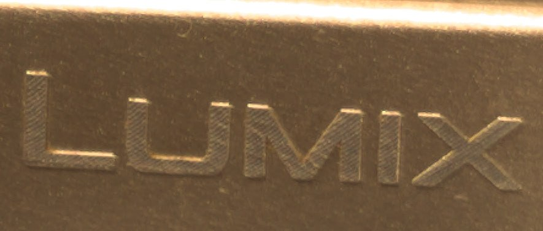
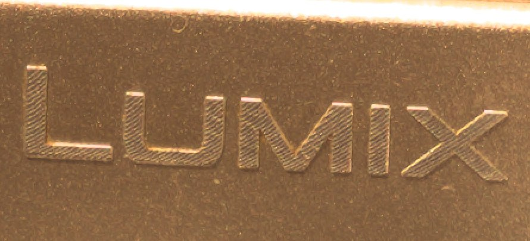

Save uncompressed 14-bit DNG files after mechanical shutter actuation,
bypassing Canon's CR2 compression. Requires Canon quality set to RAW.

The DNG file is saved alongside Canon's native CR2/JPEG in the DCIM folder.

|                       RAW                        | DNG |
|:--------------------------------------------------------:|:---:|
|  |  |